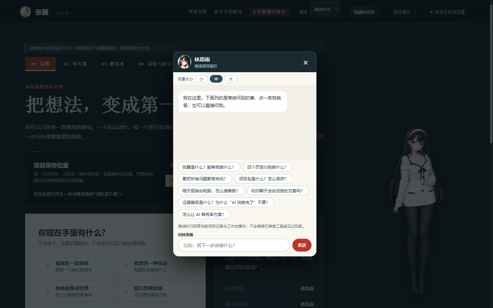

# Zhangyi · Spread the Pinions

> You're just one person. But you can still spread your wings.

Zhangyi is a set of **game-design coaching skills** that live inside your AI assistant. Bring it a one-line idea, a "should I do this" dilemma, or an existing plan; it answers with a draft you can react to, then points out the trade-offs that will actually shape the player experience, and stays with you through prototypes and real-player feedback. You make the calls — it makes sure every judgment comes with a reason and every unverified risk stays on record.

It will never pass its suggestions off as your decisions, and it will never call a game "fun" on the basis of a paper plan or a prototype it generated itself.

## Two ways to use it — separately or together

**Option 1 · Install the skills into your AI assistant and just talk.** Copy `skills/` into your agent's skills directory (see [Install](#install)), then tell your AI "I want to make a game." The skills handle the judgment: drafts, verdicts, and an archive of decisions.

**Option 2 · Install nothing — just open the Studio.** Double-click [`启动张翼工作台.bat`](启动张翼工作台.bat) and a local page walks you through 01 Kickoff → 02 Plan review → 03 Build it → 04 Playtest & revise. Fully offline; everything you decide exports into a portable project package. The Studio makes your choices visible, editable, and carryable. (The Studio UI ships in Chinese and English; design documents and exports are in Chinese for now.)

The two compose: hand the Studio's project package to an AI that has the skills installed, and import the AI's structured review back into the Studio to accept or reject item by item.

## What your first session looks like

You say: **"I want to make a game about running a cat café."** No jargon needed — no "core loop", no "design pillars". Zhangyi's first deliverable is a one-page draft you can react to:

| You give Zhangyi | Zhangyi moves forward | What you see change |
|---|---|---|
| One sentence about a cat café | Your first ten minutes of play: serve the first customer, seat cats and guests, handle the cat that refuses to work | A theme becomes something a player actually does |
| You want décor, breeding, delivery and social features at once | Suggests keeping only "matching cats to guests" in version one, cutting the rest — with what each cut buys you | The scope shrinks; the game's special part gets sharper |
| "But will it be fun?" | Defines the smallest playable slice: three cats with distinct temperaments, three customers with conflicting needs — then have strangers play it and watch whether they own their choices | A vague worry becomes an observable question |

The draft is never a decision made for you. Say "actually, décor is the part I care about", and Zhangyi should redesign around décor and tell you what keeping it costs. Its value is **making reasoned judgments and accepting your corrections** — not announcing "I used a skill" in the reply.

## When to reach for it

| Your situation | Say something like | What you should get |
|---|---|---|
| A fuzzy idea | "I want to make… help me land it." | First ten minutes, the hook, what to cut, the next step |
| You love an existing game | "I played Civilization VI and want one set in another era." | The difference between a mod, a standalone slice and a full game; recreate your favorite part first — no innovation demanded |
| You want to play your idea fast | "Picked the direction — skip the jargon, make the smallest playable version." | A prototype that opens, plays, ends and restarts — plus what it is meant to test |
| Considering a feature | "Should I add multiplayer / gacha / a second combat system?" | The problem it solves, the cost, and a verdict: yes / later / no |
| Story and mechanics feel divorced | "How does this plot beat connect to what the player does?" | What characters want, what player choices change, how the story moves on wins and losses |
| The numbers feel wrong | "Will this economy / win rate wall players?" | Assumptions in writing first, then a simulation — with what the model can and cannot prove |
| A playable build exists | "I'm getting a few people to play it — what should I watch?" | A playtest task, observation points, a recording method, conclusions bound to sample size |
| Ship day, or a new day | "Can I release?" / "Pick up where we left off." | An evidence-based readiness check / a handoff archive that resumes cleanly |

## Why "Zhangyi"

Most AI game tools solve for *production capacity*. Zhangyi solves for *judgment*.

- **It decides**: every review ends in a verdict (yes / later / no). Never "both have merit".
- **It's honest**: every output ends with an honesty statement — what this round proves and what it cannot.
- **It retracts**: when new evidence arrives, it publicly withdraws its earlier conclusion and records why.
- **It keeps a kill list**: rejected ideas go on a list; resurrecting one requires new evidence.
- **It leaves a record**: every review produces a numbered verdict document inside *your* project — a decision history you own.

## The Studio and the archive

Double-click [`启动张翼工作台.bat`](启动张翼工作台.bat) (Windows; on other systems serve `nest/` locally with Node). The launcher picks a free port and opens the page; keep the console window open. The Studio is offline rule-based guidance — it never calls a model by itself, and it never claims to have run your build or met your players.

Also included: a **verdict archive viewer** (`nest/index.html`) — drop your project's `verdicts/` folder in and browse your decision documents with proper seals and print-ready formatting.

## Current scope (v0.6.1 · 2026-10-01)

| Skill | Stage | Status |
|---|---|---|
| `zhangyi` | Entry: stage routing, voice discipline, onboarding ritual | ✅ |
| `zhangyi-kickoff` | Kickoff: problem definition, design pillars, mechanic biopsy, plan verdicts | ✅ |
| `zhangyi-systems` | Systems: refinement questions, review gates, numeric discipline, balance | ✅ |
| `zhangyi-narrative` | Narrative: story-as-mechanic, character will, naming discipline, pacing | ✅ |
| `zhangyi-probe` | Probes: pre-registration, confidence-bound gates, metric audits, replication | ✅ |
| `zhangyi-playtest` | Playtests: real-player verification, routing, recruiting, interviews | ✅ |
| `zhangyi-review` | Release review: evidence calibration, graded conclusions, launch checklists | ✅ |
| `zhangyi-relay` | Relay: cross-session handoffs and continuity | ✅ |
| `zhangyi-takeover` | Takeover: read-only audits, authorized reorganization, task orchestration | ✅ |

## Install

Copy the skill folders you want from `skills/` (9 total) into your agent's skills directory:

- Kimi Code: `C:\Users\<you>\.agents\skills\`
- Claude Code: `~/.claude/skills/`

Then open your game project and tell the AI "I want to make a game" — or just describe your idea. Read its draft, then correct whatever doesn't match your intent.

## The first-flight ritual

The first time Zhangyi works inside your project, it leads with a playable concept draft; only after your corrections does it write the settled direction into your project config and the first verdict document. If you only ask "what can Zhangyi do", it creates nothing.

## License & credits

- Code and docs in this repository: MIT (see [LICENSE](LICENSE))
- `cards/`, the insight card library: distilled claims, scenarios, annotations and source links only — **no original text**. Copyright of the referenced works stays with their authors; Zhangyi cites ideas and credits sources.

---

*Zhangyi · Spread the Pinions — so that one person can spread their wings too.*

*中文说明见 [产品说明书](docs/产品说明书.md)（工作台与流程的权威中文文档）。*
